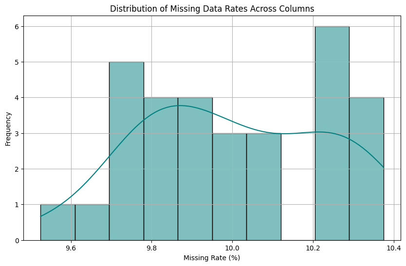
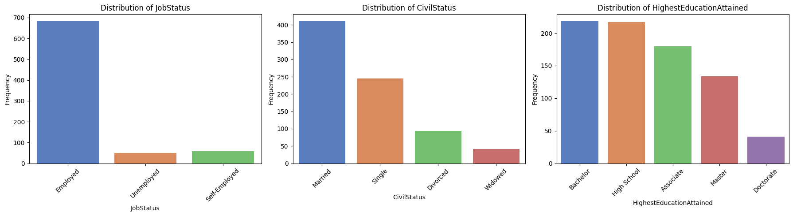
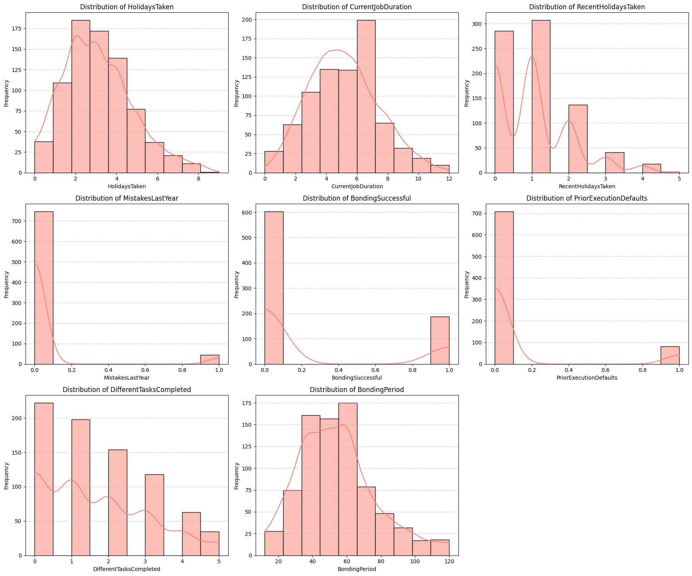
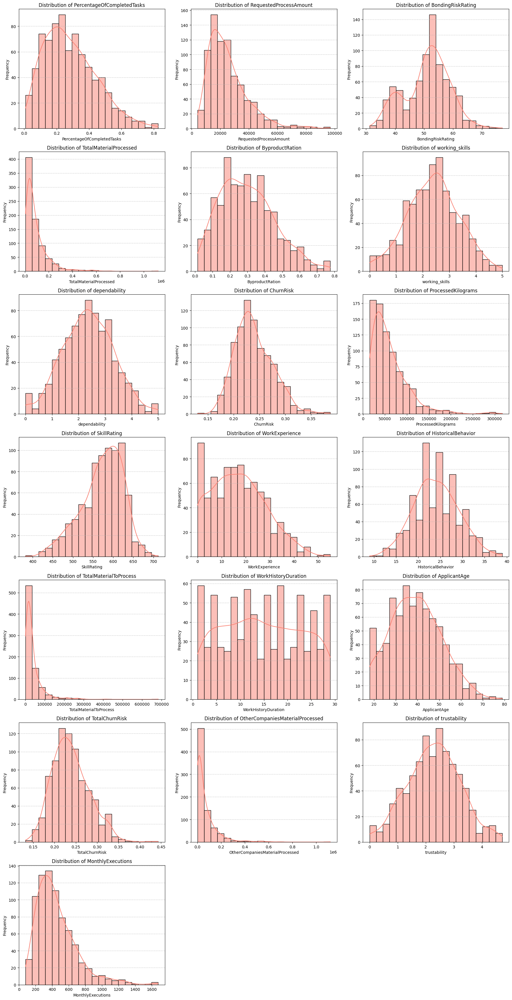

# aerogelBonding_303401

## Team Members

- Igor Miljenovic 303401
- Milan Milovanovic 297541

## Section 1: Introduction

This project builds on the foundation of our previous work in predictive modeling and machine learning by focusing on the aerogel bonding domain. Aerogel bonding, a complex industrial process, poses significant challenges in ensuring consistent outcomes. By leveraging advanced data analysis and machine learning techniques, this project aims to develop a robust system for predicting bonding success while gaining deeper insights into the factors influencing these outcomes.

The dataset at the core of this project contains diverse numerical and categorical features, including applicant demographics, process metrics, and operational variables. Our approach began with a thorough exploratory data analysis (EDA) to understand data patterns, identify potential outliers, and address missing values. From there, we applied rigorous preprocessing techniques, such as feature engineering and data profiling, to prepare the dataset for modeling.

The machine learning phase of the project explored several models, including Logistic Regression, Random Forest, K-Nearest Neighbors (KNN), and Gradient Boosting. These models were selected for their unique strengths in handling classification tasks, and their performance was systematically evaluated. Feature selection and hyperparameter tuning further refined the models, enhancing their predictive accuracy and generalization capabilities.

The results demonstrate the effectiveness of our methodology, with Logistic Regression achieving perfect classification and other models, such as Random Forest and Gradient Boosting, also delivering strong performance. This project not only highlights the technical capabilities of machine learning in addressing industrial challenges but also provides actionable insights into the aerogel bonding process, paving the way for future advancements in predictive modeling for similar domains.

---

**Setup Instructions**
To recreate the environment used for this project in **VSCode**, follow these steps:

1. **Clone the Repository**
   Start by cloning the repository to your local machine using HTTPS:

   ```bash
   git clone https://github.com/igormiljenovic/aerogelBonding_303401.git
   cd aerogelBonding_303401
   ```

2. **Create and Activate Environment**
   Using `requirements.txt`:

   ```bash
   python -m venv venv
   .\venv\Scripts\Activate      # On Windows
    source venv/bin/activate    # On macOS/Linux
    pip install -r requirements.txt
   ```

   Launch vscode:

   ```bash
   code .
   ```

3. **Ensure Necessary Extensions**
   Ensure that you have the following extensions installed in **VSCode**:

   - **Python**: For Python support and managing the virtual environment.
   - **Jupyter**: For working with Jupyter Notebooks.

   You can install these extensions from the **VSCode Extensions Marketplace**.

4. **Select the Python Interpreter**
   In VSCode, press Ctrl + Shift + P (or Cmd + Shift + P on macOS) to open the Command Palette.
   Search for and select Python: Select Interpreter.
   Choose the Python interpreter associated with your virtual environment (venv).

## Section 2: Methods (**EDA & Data Pre-Processing**)

### Exploratory Data Analysis (EDA)

Exploratory Data Analysis (EDA) was a critical phase of the project, aimed at understanding the dataset and preparing it for modeling. This section highlights the detailed steps carried out during EDA.

#### Dataset Overview

The dataset comprises 20,000 rows and 31 columns, containing both numerical and categorical features. The numerical features include metrics such as "ApplicantAge" and "ProcessedKilograms," while categorical features include "JobStatus" and "CivilStatus." Missing values were observed in several columns, such as "HolidaysTaken" and "RequestedProcessAmount," requiring careful handling during preprocessing.

The dataset's structure was explored by examining data types, missing values, and summary statistics. For example, "ApplicantAge" has an average age of 40 years, ranging from 18 to 80, indicating a diverse distribution. Similarly, "ProcessedKilograms" exhibited high variability, reflecting differences in operational performance.

#### Handling Missing Values

A key aspect of EDA was identifying and addressing missing data. Missing rates were calculated for all columns, revealing that most columns had around 10% missing values. The distribution of missing rates is visualized in the chart below:



This uniform missingness pattern led to the decision to remove rows with missing values rather than applying imputation methods. While this reduced the dataset size, it ensured that the integrity of the data structure remained intact and minimized the risk of introducing bias. This approach was feasible given the manageable reduction in data size.

#### Irrelevant Data Analysis

Columns with low variance were flagged for potential removal as they provided limited information for the analysis. Examples of low-variance columns included "RecentHolidaysTaken" and "MistakesLastYear," which showed minimal variability. While these columns were considered for exclusion, domain knowledge was also factored into the final decision-making process.

High correlation among features was also examined to identify redundancy. However, no significant high correlations were found that required column merging or removal. This ensured that all retained features contributed meaningful and independent information to the analysis.

#### Visualizing Data

To better understand the data, visualizations were created to analyze distributions, outliers, and relationships. Histograms, box plots, scatter plots, and a heatmap of the correlation matrix were employed to uncover trends and guide feature selection for modeling.

#### Feature Engineering

To improve model performance, feature engineering was applied. Temporal features were extracted from the "ProcessingTimestamp" column, such as the year, month, and day, enabling time-based analysis. Categorical variables were encoded using techniques like one-hot encoding, ensuring compatibility with machine learning algorithms. Numerical features were normalized to ensure consistency across different scales.

#### Insights and Hypotheses

EDA revealed key insights, such as the majority of applicants being employed and married, with many holding a bachelor's degree. "BondingRiskRating" exhibited consistent assessment criteria, while some features displayed high variability and potential outliers, requiring careful consideration during modeling. These findings guided subsequent modeling efforts, ensuring a strong foundation for predictive models tailored to the aerogel bonding process.

### Data Profiling and Statistical Overview

Data profiling provided a comprehensive exploration of the dataset's characteristics, ensuring a deeper understanding of its statistical properties, distributions, and relationships. This process involved analyzing categorical, discrete numerical, and continuous numerical variables to uncover meaningful patterns and anomalies.

#### Categorical Variables

Categorical variables such as "JobStatus," "CivilStatus," and "HighestEducationAttained" were analyzed to understand their distributions and identify potential imbalances. For example, 85.17% of individuals were employed, highlighting a dominant category that may influence model predictions. Similarly, "HighestEducationAttained" showed a majority of individuals holding a bachelor's degree, while "CivilStatus" reflected that over 50% of individuals were married.

Visualizations like bar charts were used to represent the frequency of these categories, providing insights into the dataset's structure. This analysis guided decisions on encoding techniques, such as one-hot encoding, to ensure categorical variables were appropriately handled during preprocessing.



#### Discrete Numerical Variables

Discrete numerical variables, such as "HolidaysTaken," "CurrentJobDuration," and "MistakesLastYear," were analyzed using descriptive statistics and visualizations. The analysis revealed key patterns:



"HolidaysTaken" had a mean of approximately 3 days, with occasional outliers reaching 13 days.

"CurrentJobDuration" showed most individuals had been in their current job for 3 to 6 years, with outliers extending to 16 years.

"MistakesLastYear" was highly skewed, with the majority reporting zero mistakes.

These variables exhibited skewed distributions, requiring careful consideration during modeling to ensure they did not introduce bias. For example, the variable "BondingSuccessful" was imbalanced, with only 23.9% of cases being successful. This imbalance required strategies like resampling or class weighting to improve model fairness.

#### Continuous Numerical Variables

Continuous numerical variables, including "ProcessedKilograms," "BondingRiskRating," and "SkillRating," were analyzed for central tendencies, variability, and potential outliers. Key observations included:



"ProcessedKilograms" had a mean of 59,189 but exhibited extreme outliers reaching 485,341, indicating significant variability.

"BondingRiskRating" was centered around a mean of 50.76, with a narrow standard deviation, suggesting consistent risk assessments.

"SkillRating" demonstrated a moderately strong correlation with the target variable, highlighting its importance as a predictive feature.

Statistical summaries and visualizations, such as histograms and box plots, were used to illustrate these patterns, guiding feature selection and preprocessing.

#### Addressing Anomalies

Outliers and skewness were addressed using transformations and capping techniques. For example, variables like "HolidaysTaken" and "ProcessedKilograms" underwent capping to reduce the influence of extreme values. Additionally, variables with high skewness, such as "MistakesLastYear," were transformed to improve their distributions.

#### Feature Relationships

Correlation analysis highlighted relationships between features and the target variable. Highly correlated features, such as "TotalMaterialProcessed" and "OtherCompaniesMaterialProcessed," were identified as redundant, allowing one of them to be removed. Similarly, weakly correlated features like "MonthlyExecutions" were flagged for potential exclusion, simplifying the dataset and enhancing model interpretability.

#### Summary of Data Profiling

Through detailed data profiling, the dataset was refined to ensure high quality and relevance for modeling. Key steps included addressing missing values, removing redundant features, transforming skewed variables, and encoding categorical data. These efforts provided a strong foundation for machine learning, enabling robust and interpretable models tailored to the aerogel bonding domain.

### Correlation Heatmap

Correlation analysis helped identify relationships between features and the target variable, "BondingSuccessful." Highly correlated features, such as "TotalMaterialProcessed" and "OtherCompaniesMaterialProcessed," indicated redundancy, allowing one of the features to be removed to avoid multicollinearity. The analysis also highlighted key correlations with the target variable, such as the strong relationship between "SkillRating" and "BondingSuccessful," making it a critical feature for classification. Weakly correlated features, like "MonthlyExecutions," were considered for exclusion to simplify the model.

## Section 3: Experimental design (**Machine Learning Model**)

## Section 4: Results (**Evaluation and Analysis of Obtained Results**)

### Final Overall Observations

Logistic Regression emerged as the most reliable model, achieving perfect classification and generalization. Its simplicity and interpretability make it ideal for deployment, particularly in scenarios requiring efficient and stable performance. Random Forest and Gradient Boosting performed exceptionally well, with their ensemble-based approaches offering robustness and feature importance insights. However, their slight overfitting tendencies and single misclassifications make them marginally less reliable than Logistic Regression. K-Nearest Neighbors, while effective, showed greater sensitivity to data variability and may face challenges with scalability or noisy datasets.

### Thorough Machine Learning Model Evaluation

The journey through this project has provided a comprehensive exploration of the classification task, incorporating several crucial steps, including data preprocessing, feature selection, model tuning, evaluation, and analysis. Each stage contributed valuable insights into the behavior, performance, and effectiveness of the models we applied. The evaluation reflects not only the technical success of the task but also the deeper understanding of model performance and its implications.

Starting with the initial models—Logistic Regression, Random Forest, K-Nearest Neighbors (KNN), and Gradient Boosting—we observed solid baseline performances, with all models achieving high accuracy and meaningful classification metrics. The initial results set a strong foundation, but they also prompted us to focus on issues like potential overfitting and opportunities for optimization. This led to a systematic reduction of features using feature importance rankings, which allowed us to isolate the most impactful variables and simplify the models. This step was pivotal, as it reduced model complexity while maintaining strong performance, particularly for Logistic Regression and Random Forest.

### Feature Reduction and Model Tuning

The reduction of features to a smaller, focused subset was a significant step in this project. By narrowing down to the top 10 features based on their importance scores, we simplified the data while preserving the predictive power. This process not only enhanced computational efficiency but also improved the generalization of certain models, particularly KNN, which benefited greatly from the reduced feature set. Removing redundant and less influential features allowed us to focus on the most impactful variables, such as BondingRiskRating and ProcessedKilograms, which emerged as key predictors.

Model tuning further refined the performance of each model. Grid Search and Randomized Search revealed optimal hyperparameters that balanced model complexity and performance. Logistic Regression, with its simplicity and interpretable nature, achieved its best results through a careful adjustment of the regularization parameter (C), resulting in a model that was both robust and computationally efficient. Random Forest and Gradient Boosting, both more complex ensemble methods, demonstrated their robustness with optimized parameters such as tree depth, number of estimators, and splitting criteria. These adjustments allowed these models to generalize well while minimizing the risk of overfitting. KNN, while sensitive to data distribution and local neighborhoods, also showed improvement after tuning, highlighting the importance of hyperparameter calibration to avoid underfitting or overfitting.

## Section 5: Conclusion

This project successfully demonstrated the power and nuances of machine learning models in a classification task. Each stage, from feature selection to tuning and evaluation, provided valuable insights into the models’ behavior, strengths, and limitations. Logistic Regression stood out as the most efficient and reliable model, achieving perfect performance while remaining simple and interpretable. Random Forest and Gradient Boosting, with their robust ensemble-based approaches, offered strong alternatives with slight trade-offs in complexity. KNN, despite its sensitivity to data patterns, proved its worth as a competitive model under the right conditions.

The systematic evaluation of these models highlighted the importance of balancing complexity, interpretability, and performance. The thorough analysis and observations throughout this project have not only validated the models’ effectiveness but also provided a deeper understanding of their behavior, enabling informed decisions for future applications. This project underscores the significance of rigorous experimentation and thoughtful evaluation in achieving machine learning success.
